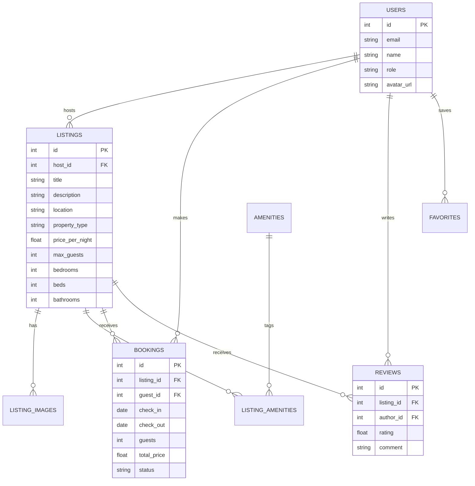

# Airbnb Fullstack Clone

A full-stack, pixel-perfect clone of the **Airbnb** web application built with **Next.js (TypeScript)**, **FastAPI (Python)**, and **SQLite**. Recreates Airbnb's core browse, search, booking, wishlist, reviews, and host management workflows with modern UI/UX design.

---

## 🌟 Key Features

### 1. Home & Search Experience
- **Explore Grid**: Responsive listing cards with photo carousels, title, location, price per night, and rating badges.
- **Search Bar**: Interactive filter bar for destination search, date range selection, and guest count tracking.
- **Category & Filter Bar**: Filter by property types (Cabins, Beachfront, Mansions, Trending, Lakefront), price range, and amenity tags.
- **Pagination & Sorting**: Paginated listing fetch with server-side limit/offset querying.

### 2. Listing Details Page (`/listings/[id]`)
- **Photo Gallery**: High-resolution image grid with gallery viewing modal.
- **Host & Property Specs**: Detailed breakdown of bedrooms, beds, bathrooms, max guests, host info, and property description.
- **Interactive Booking Widget**: Real-time stay calculation (nightly rate × nights + cleaning fee + service fee).
- **Date Availability Validation**: Instant checking against overlapping confirmed bookings.
- **Reviews & Ratings**: Review aggregation with individual star ratings and reviewer feedback.

### 3. End-to-End Booking & Trips (`/checkout`, `/trips`)
- **Mock Checkout**: Instant booking creation with payment method choices (UPI, Card, Netbanking) and simulated payment processing.
- **Trip Persistence**: Booked stays are saved to the database and block future bookings on overlapping dates.
- **My Trips View**: Displays active and past stays with reservation summary and cancellation options.

### 4. Host Experience (`/host`)
- **Host Dashboard**: Management panel for viewing owned listings and guest reservations.
- **Create Listing**: Multi-step listing creation with title, location, property type, nightly rate, guest capacity, image URLs, and amenity tagging.
- **Edit & Delete**: Full CRUD actions to modify or remove existing host listings.

---

## 🛠️ Tech Stack & Architecture

### **Frontend**
- **Framework**: Next.js 16 (App Router)
- **Language**: TypeScript
- **Styling**: Tailwind CSS, Lucide React icons
- **State & Data Fetching**: React Hooks + REST API

### **Backend**
- **Framework**: FastAPI (Python)
- **Database**: SQLite with SQLAlchemy ORM
- **API Architecture**: Modular APIRouter pattern (`/listings`, `/bookings`, `/host`, `/reviews`, `/favorites`)
- **Data Validation**: Pydantic schemas

---

## 📊 Database Schema



---

## 🚀 Setup & Installation Instructions

### Prerequisites
- **Node.js**: `v18+`
- **Python**: `v3.10+`

### 1. Backend Setup

```bash
cd backend

# Create virtual environment
python -m venv venv

# Activate virtual environment
# Windows:
.\venv\Scripts\activate
# macOS/Linux:
source venv/bin/activate

# Install dependencies
pip install fastapi uvicorn sqlalchemy pydantic

# Seed database with sample listings, hosts, and reviews
python seed.py
python seed_amenities.py
python seed_more.py

# Start FastAPI development server
uvicorn main:app --reload --port 8000
```
Backend API will run at: `http://127.0.0.1:8000`

### 2. Frontend Setup

```bash
cd frontend

# Install dependencies
npm install

# Run Next.js development server
npm run dev
```
Frontend Web App will run at: `http://localhost:3000`

---

## 📝 API Endpoints Overview

| Method | Endpoint | Description |
| :--- | :--- | :--- |
| `GET` | `/listings/` | Fetch paginated listings with location, price, and availability filters |
| `GET` | `/listings/{id}` | Fetch detailed listing specs, images, amenities, and reviews |
| `GET` | `/bookings/availability` | Check if date range is available for a listing |
| `POST` | `/bookings/` | Create a new confirmed booking |
| `GET` | `/bookings/my-trips` | Fetch all trips reserved by a user |
| `GET` | `/host/listings` | Fetch all listings created by a host |
| `POST` | `/host/listings` | Create a new listing as a host |
| `PUT` | `/host/listings/{id}` | Update an existing listing |
| `DELETE` | `/host/listings/{id}`| Remove a listing |
